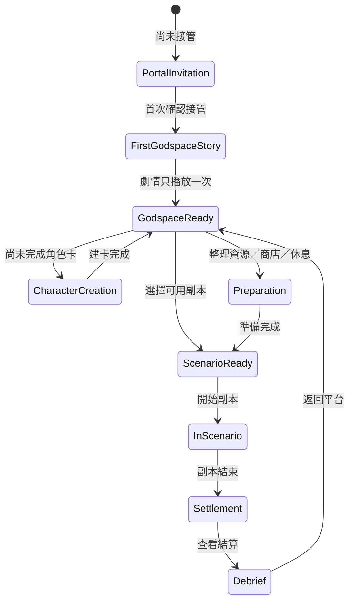

# 《無限恐怖 TRPG》主神空間互動與長期發展藍圖

**文件狀態：規劃文件**
**適用範圍：目前的單副本版本，以及未來逐步擴充到多副本、多世界與多人功能的方向**
**目前不納入實作：排行榜、跨副本承接、world memory、主神空間自由聊天**

## 一、設計定位

主神空間不應只是「副本結束後的一個返回畫面」，也不應立刻變成另一個需要大量 API 呼叫的開放式聊天遊戲。它更適合被設計成一個**承接結算、整理角色、準備下一場輪迴的狀態中樞**：玩家在這裡讀懂上一場副本留下的代價與收穫，決定是否整理資源、休息、調整角色，再選擇要不要進入下一個已解鎖的挑戰。

這個定位也延續《異形：生化深淵》V2 的核心分工。reference JSON、規則引擎與伺服器狀態負責裁定世界真相、物品、傷勢、獎勵、可用功能與狀態轉換；前端負責把狀態呈現成清楚、有氣氛而且可操作的介面；AI 只在需要時負責演出已確定的劇情片段，不負責替主神創造新規則，也不負責自行承接尚未設計的世界記憶。

> **主神的核心原則：主神是介面與裁判，不是替玩家解題的 NPC。**
>
> 主神可以宣告規則、顯示結果、提出已授權的選擇與在特定節點給出系統訊息，但不應透過自由對話直接告訴玩家「正確答案」或替玩家決定下一個副本的最佳解法。

## 二、目前已具備的基礎

目前主神空間已經有一條清楚的最小流程：玩家收到副本邀請，完成角色建卡，進入副本，經過 server 計算的結算頁，再回到既有的白色平台主神空間。首次接管主神空間時會播放一次性劇情 overlay，並以 localStorage 防止每次返回都重播。這條流程已足以構成第一版的「副本—結算—主神空間」閉環。

同時，專案已有可繼續擴充的資料位置：角色卡、存檔、事件日誌、XP、獎勵點數、商店、裝備、型態、傷勢與副本 runSummary。這些狀態應視為主神空間的主要資料來源，而不是重新交給 AI 解讀後再寫回系統。

| 已有基礎 | 在主神空間中的用途 | 現階段策略 |
|---|---|---|
| 副本結算頁 | 顯示結局、S/A/B/C/D 評價、速度與品質、XP、獎勵點數、傷勢、感染、NPC 與樣本狀態 | 立即保留並打磨視覺與資訊層級 |
| 首次主神空間劇情 overlay | 建立「被主神接管」的世界觀入口 | 保留固定一次性劇情，不改成每次呼叫 LLM |
| 白色平台主神空間 | 角色回到副本之間的安全中樞 | 目前以固定 UI 與狀態文案為主 |
| 角色建卡與存檔 | 讓玩家有可持續使用的輪迴者身份 | 保留，並在 hub 顯示明確狀態 |
| 商店與購買紀錄 | 提供有限的角色準備與資源分配 | 可使用，但不擴張成完整經濟系統 |
| 事件日誌與 runSummary | 讓玩家回顧上一場副本的事實結果 | 以結構化摘要呈現，不由 AI 重寫真相 |

## 三、主神空間的資訊架構

第一版主神空間建議採用「中心平台＋狀態側欄＋少量明確入口」的結構，而不是堆疊大量功能按鈕。玩家每次回來最需要知道的是自己現在是否能行動、上一場副本留下什麼、下一步有哪些合法選擇；所有其他功能都應該服從這三個問題。

| 區域 | 玩家看到的內容 | 互動目的 | 真相來源 |
|---|---|---|---|
| 平台中央 | 主神平台、目前角色名稱、輪迴狀態與一段固定系統文案 | 建立空間感與返回安全區的感受 | session 與固定 UI 文案 |
| 左側角色狀態 | HP／傷勢、感染、持有 XP、獎勵點數、裝備與可用資源 | 讓玩家知道自己能否再次出發 | server session、character、runSummary |
| 右側副本摘要 | 上一場副本名稱、結局、評價、速度、品質、威脅峰值、主要收穫與代價 | 讓玩家理解上一場遊戲的結果 | server-computed runSummary |
| 下方行動列 | 查看結算、整理資源、休息、商店、再次進入或等待解鎖 | 提供有限而明確的下一步 | server 驗證後的 actions |
| 系統通知區 | 主神宣告、解鎖提示、警告與不可逆狀態 | 呈現世界規則，不提供解題答案 | 結構化狀態與固定文案 |

主神空間的按鈕不應只在視覺上「看起來可以按」。每個操作都應由伺服器回傳可用性與原因。例如角色仍處於死亡、昏迷、未完成結算或存檔狀態不允許再次出發時，按鈕應顯示明確的 disabled reason，而不是讓玩家點擊後才得到模糊錯誤。

## 四、狀態轉換設計

主神空間需要先有清楚的狀態機，再決定要不要加入更多演出。建議將「玩家目前在哪裡」與「玩家目前能做什麼」分開保存；畫面可以有多種 overlay，但 server 的狀態轉換仍然保持有限且可驗證。

這個狀態機刻意沒有「主神自由聊天」或「AI 自動決定下一站」兩個狀態。未來即使加入低頻系統宣告，也應該只是某個狀態轉換的演出，不應改變核心狀態機。

## 五、Phase A：目前的單副本完成版

### 5.1 目標

Phase A 的目標不是把主神空間做成大型社交大廳，而是讓《異形：生化深淵》V2 跑完後，玩家能感受到一個完整的閉環：**副本結果被正確收束、角色代價被清楚保存、主神空間提供下一步準備、玩家可以安全返回或重新開始**。

### 5.2 建議互動內容

副本結算後，主神空間首先應提供一次 **debrief／戰後整理**。這不是新增 AI 長篇對話，而是把 server 的 runSummary 轉成數個固定區塊：本次結局、評價、剩餘回合換得的速度 points、品質分數、威脅峰值、遭遇次數、XP、獎勵點數、NPC 存活與否、樣本狀態、感染狀態與留下的傷勢。

接著提供 **角色狀態整理**。玩家應能看到「這些是副本內帶出的永久或半永久結果」，並能分辨哪些資源已經消耗、哪些傷勢仍在身上、哪些物品可以保留。副本內的物品是否可帶出，必須由 reference 或 item metadata 裁定，不能讓前端依名稱猜測。

最後提供有限的 **準備行動**：查看上一場結算、進入商店、休息或恢復、再次進入仍可繼續的存檔、選擇已開放的副本。每一個行動都應有清楚的成本與結果。若第一版尚未設計永久傷勢恢復、裝備購買或再次進入規則，就寧可顯示「功能尚未開放」，也不要先放一個會造成玩家誤解的假按鈕。

| Phase A 功能 | 建議呈現 | 是否需要 AI |
|---|---|---|
| 副本後 debrief | 結算頁延伸卡片與固定摘要 | 否 |
| 傷勢與資源整理 | 結構化狀態面板 | 否 |
| 返回主神平台 | 明確返回按鈕與一次性劇情控制 | 否，首次劇情固定演出 |
| 再次進入／繼續 | 只對合法存檔顯示 | 否，server 驗證 |
| 商店 | 顯示商品、價格、購買結果與物品變化 | 否 |
| 主神系統宣告 | 少量固定文案，例如「結算已封存」 | 可選固定模板，不需 LLM |
| 主神自由聊天 | 暫不提供 | 不使用 |

### 5.3 Phase A 的完成判準

Phase A 完成的判準是玩家不需要閱讀開發者 console，也不需要猜測資料欄位，就能回答以下問題：我怎麼結束上一場副本？我拿到了什麼？我失去了什麼？我現在受了什麼傷？我還能不能繼續？我下一步能做什麼？如果玩家看不懂其中任何一項，優先修正資訊架構，而不是先增加新的劇情生成。

## 六、Phase B：完成兩至三個副本後

Phase B 必須等至少兩至三個副本的基本結算格式穩定後才開始。這一階段才適合讓主神空間出現「可選擇的長期內容」，但仍應以結構化狀態為核心，不急著讓 AI 自由發揮。

### 6.1 受限主神任務板

任務板可以列出已由內容作者定義的下一個副本、訓練任務或特殊挑戰。每張任務卡都應有固定的前置條件、推薦風險、可能帶出的資源類型與是否會消耗某種準備資源。主神只負責顯示「目前可不可以進」，不直接告訴玩家哪條路一定最優。

任務板的資料應採用版本化 reference 或 scenario registry。玩家看到的副本標題、解鎖條件、進入成本與結算規則都由 server 提供；AI 可以在極低頻率下為「已解鎖任務」產生一小段氣氛宣告，但這段文字不可以創造新的任務條件或改寫獎勵。

### 6.2 訓練與休息

訓練與休息可以作為副本之間的資源交換系統，但不應立刻做成無限刷點。每個行動應有固定時間、點數或恢復上限，並以 server 重新計算角色狀態。初期可先提供「短休」與「完整恢復」兩種清晰行動；若要新增技能訓練，應先定義 XP 消耗、訓練上限、是否會影響下一場副本以及對舊存檔的相容策略。

### 6.3 紀念櫃與輪迴檔案

紀念櫃是比 world memory 更安全的過渡功能。它只保存玩家明確帶出的結構化成果，例如實體記錄、權限卡、樣本、結局徽記、NPC 證詞或副本評價，不宣稱這些物品能自動改變另一個尚未設計的副本。

輪迴檔案則保存每次 runSummary、角色當時的版本、主要結局、評價與事件日誌摘要。這能讓玩家感覺到「我確實走過這一場」，但不會讓 AI 自行從一大段歷史推導出新的世界狀態。

### 6.4 結構化 NPC／世界記憶的第一版

如果未來要做 NPC 或世界記憶，Phase B 先只保存以下類型的資料：玩家是否遇見某 NPC、NPC 最後狀態、玩家對 NPC 做過的已裁定行動、可承接的固定旗標、來源副本版本與建立時間。這些資料必須是作者明確聲明「可承接」的欄位，而不是把全部敘事 history 丟給下一個 AI。

| Phase B 資料 | 建議欄位 | 明確不做的事 |
|---|---|---|
| 任務板 | `missionId`、`scenarioVersion`、`requirements`、`status` | 不讓 AI 自動生成任務獎勵 |
| 訓練／休息 | `actionId`、`cost`、`cooldown`、`effects` | 不讓 AI自行決定恢復數值 |
| 紀念櫃 | `itemId`、`sourceRunId`、`carryOverPolicy` | 不因物品名稱推導特殊能力 |
| 輪迴檔案 | `runSummary`、`endingId`、`evaluation`、`version` | 不把自然語言摘要當世界真相 |
| NPC 記憶 | `npcId`、`status`、`trustTier`、`witnessedFlags` | 不保存未被 NPC 見證的玩家行動 |

## 七、Phase C：多玩家或多世界成熟後

Phase C 只在多人遊玩量、內容版本管理與資料治理都成熟後進行。這些功能的吸引力很高，但它們同時會把「一次副本是否能正確結算」提升成「不同玩家、不同版本、不同世界狀態之間是否能互相解釋」的問題，因此不適合在第一個副本尚未完全穩定時搶先製作。

### 7.1 版本化排行榜

排行榜不能只存一個分數。至少需要保存 `scenarioId`、`scenarioVersion`、規則版本、角色版本、是否使用允許的輔助功能、完成時間資源、速度 points、品質、總評與結算狀態。否則規則調整後，舊玩家的快速通關會與新版本玩家直接混在一起，排行榜會失去公信力。

排行榜也應區分「速度榜」「品質榜」與「綜合評價」，並清楚標記測試、重試、管理員 fixture 或不符合正式規則的紀錄。這些前置條件完成前，不應在 Phase A 顯示空排行榜入口，以免玩家以為系統已經承諾一個尚未存在的競爭規則。

### 7.2 world delta persistence

跨副本承接不能依賴「把上一場的完整故事貼給下一個 AI」。正確做法是每個副本版本聲明可輸出的 world delta schema，再由下一個副本版本聲明自己接受哪些 delta。每條 delta 都應有來源、版本、見證條件、可變更的欄位與衝突處理規則。

例如「玩家取得 937 實體記錄」可以是一條可承接的證據 delta；但「玩家讓整個諾斯托羅莫號變得更危險」不能直接當成跨副本世界旗標，除非作者定義了它的具體效果、適用時間線與可被誰知道。

### 7.3 社交與工坊

多人社交、玩家創作副本與工坊需要權限、審核、版本鎖定、作者署名、惡意內容處理與資料隔離。它們不只是 UI 功能，也不是多接一個 AI prompt 就能完成。未來若要做，應先建立副本 schema 驗證器、內容審核流程、可重現測試 fixture 與版本發布規則，再考慮讓玩家分享內容。

| Phase C 功能 | 必要前置條件 | 現在不做的理由 |
|---|---|---|
| 版本化排行榜 | 穩定的 runSummary、版本欄位、反作弊與重試規則 | 第一個副本仍在文筆與規則服從驗證 |
| 跨副本 delta | 輸入／輸出 schema、版本相容、衝突裁定 | 尚未有第二個正式承接副本 |
| NPC 長期記憶 | 見證模型、信任層級、資料刪除與修訂策略 | 容易把 AI 推測誤當成世界事實 |
| 多玩家社交 | 帳號權限、隱私、審核與同步 | 目前仍以單人單副本品質為優先 |
| 玩家工坊 | schema validation、沙盒執行、版本發布與審核 | 會大幅擴張安全與維運範圍 |

## 八、主神人格與 AI 使用原則

主神的人格不應透過每一次進入 hub 都呼叫 LLM 來維持。這會增加成本與等待，也會讓「主神到底說了什麼」變成非決定性的內容。第一版建議使用**固定狀態文案＋少量事件模板**：例如首次接管、結算封存、傷勢未恢復、解鎖新副本、進入副本前確認等，全部由狀態欄位選擇固定語句。

若未來要使用 LLM，建議採用低頻的「系統宣告」而非自由對話。觸發條件可以是首次接管、首次取得特殊結局、第一次看見感染狀態或首次解鎖新階段。每次生成必須附上結構化 facts，且結果只作為展示文字，不得回寫規則、物品、狀態、解鎖條件或任務內容。

| 主神行為 | 建議方式 | LLM 權限 |
|---|---|---|
| 宣告副本已結算 | 固定模板 | 無 |
| 解釋評價 | server 數值＋固定文案 | 無 |
| 首次進入劇情 | 固定 authored overlay | 無，或未來一次性生成後封存 |
| 顯示特殊結局餘韻 | facts-bound 低頻生成 | 只能演出，不可改狀態 |
| 回答「下一場怎麼做」 | 顯示可用任務條件 | 不應替玩家解題 |
| 自由聊天 | 暫不開放 | 不使用 |

## 九、反模式與防護

第一個反模式是把主神空間做成另一個「AI 什麼都能說」的房間。只要主神能自由回答，玩家很快會嘗試用話術要求它送獎勵、改傷勢、提前透露副本答案或承認一個不存在的世界狀態。這與 V2 已建立的 reference／engine 分工相衝突。

第二個反模式是把整份歷史敘事直接當成 world memory。自然語言中可能包含 AI 自己的誤寫、玩家的自我宣稱、未成功的嘗試與沒有被任何 NPC 見證的資訊。它們只能留作回顧文本，不能自動成為下一個副本的世界真相。

第三個反模式是先做漂亮入口，卻沒有處理狀態邊界。例如結算頁看起來可以再次開始，但角色仍有死亡閘門；商店顯示有物品，購買後卻沒有事件日誌；返回 hub 後看不到上一場的結局；或 refresh 後首次劇情重播。所有這些問題都比新增一個主神台詞更值得優先處理。

第四個反模式是用主神人格掩蓋規則不清。當玩家不知道為什麼不能進入下一副本時，應顯示前置條件與目前缺少的欄位，而不是讓主神用模糊、神秘的語氣搪塞。神秘感只能包裝已確定的規則，不能取代規則。

## 十、建議的實作順序

目前最合理的順序仍然是先完成單副本的可靠閉環，再擴張主神空間。第一步是固定結算頁與返回 hub 的狀態恢復；第二步是整理角色傷勢、資源、XP、獎勵點數與存檔狀態；第三步是為商店、休息、再次進入與未開放功能提供清楚的 server-owned action metadata；第四步才是新增更多主神演出。

完成兩至三個副本並累積真實遊玩資料後，再評估 Phase B 的任務板、紀念櫃與結構化輪迴檔案。等內容版本、資料 schema 與結算規則成熟後，才進入 Phase C 的排行榜與跨副本承接。這樣可以保留長期想像空間，同時不讓第一個副本的打磨被尚未有內容支撐的系統拖慢。

> **目前的產品決策：先把主神空間做成可靠的休整與結算中樞，再把它發展成世界網路。**
>
> 在《異形：生化深淵》V2 尚未完成真實 Gemini 文筆與自由輸入的品質閘門前，不新增排行榜、跨副本承接或 world memory，這不是縮減企圖，而是保護核心玩法分工與玩家信任。

## 十一、目前明確不實作的項目

本文件保留排行榜、跨副本承接與 world memory 的設計位置，但它們目前只屬於長期藍圖，不是本輪開發項目。可以預留資料欄位或版本欄位，卻不應在前端放出會讓玩家誤以為已經可用的入口，也不應讓任何尚未驗證的欄位參與《異形：生化深淵》V2 的結局、獎勵或主神狀態裁定。

目前的短期完成定義保持簡單：玩家能完成異形副本，看到 server 計算的精美結算頁與評價，在第一次進入主神空間時看到一次有意義的劇情，之後能清楚理解角色與存檔目前的狀態。只要這條路徑可靠，主神空間就已經完成了第一個真正可玩的版本。
